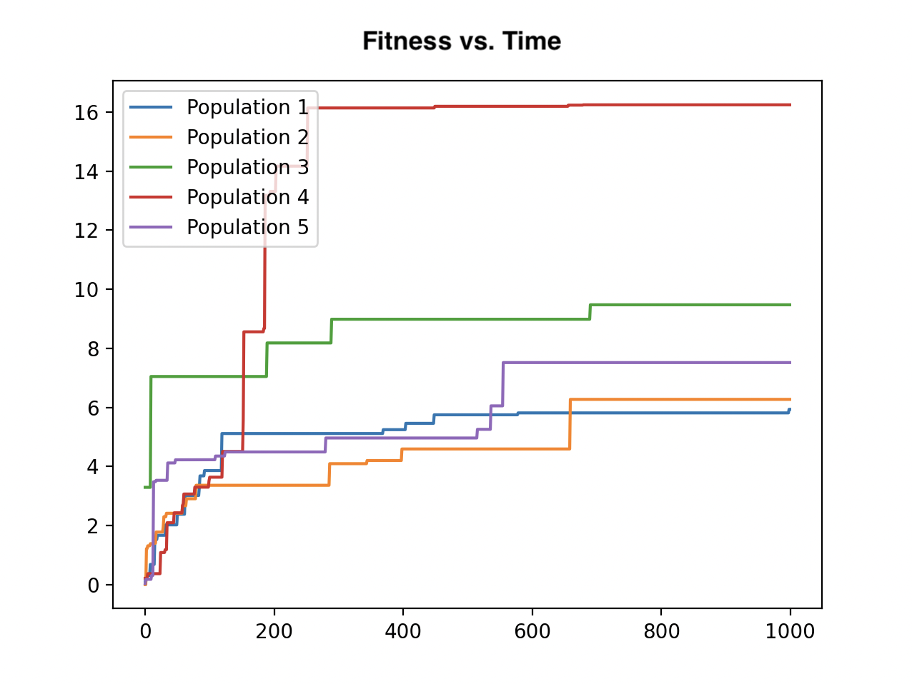

# Randomly Generated 1D Morphologies

This program creates a randomly generated kinematic chain of blocks (like a snake).


## Creature Bodies

The information for each body is organized in a randomly generated tree. An example of such a randomly generated tree is shown below.
<br/>
<br/>

<br/>
<br/>


Each node of the tree represents a link (rectangular prism) on the body. A link contains the following information:
<br/>
<br/>

<br/>
<br/>


| Variable | Description | Value |
| --- | --- | --- |
| index | A unique integer assigned to each link in the tree | An integer in the range [0, n-1], where n is the number of links in the tree |
| length | The length of the link | A randomly generated number in the range [0.2, 1.2] |
| width | The width of the link | A randomly generated number in the range [0.2, 1.2] |
| height | The height of the link | A randomly generated number in the range [0.2, 1.2] |
| hasSensor | A boolean indicating whether or not the link has a sensor | True or False |
| jointPos | Indicates where the link is attached to its parent (12 possible attachment configurations) | An integer in the range [0,11] |
| jointAxis | Indicates the axis of the joint | "1 0 0", "0 1 0", or "0 0 1" |
| depth | The depth of the link in the tree. This is sort of an "inverse depth," as the bottom-most link has a depth of 1. | An integer in the range [1, n], where n is the total depth of the tree |
| totalDepth | The total depth of the body tree. | An integer in the range [2, 5] |
| children | A list of child links | The root node can have 1-4 child links, while all other nodes can only have 0 or 1 |
| linksBelow | A list containing the link's own index as well as all the indices of it descendent links | List of node indices |
| linksWithSensors | A dictionary whose keys are the indices of all the descendent links that have sensors (including its own index if it has a sensor). The associated values are randomly generated weights in the range [-1, 1] | Dictionary with link indices as keys and random numbers in the range [-1, 1] as values. |

<br/>

__Note 1:__ Each node's *linksWithSensors* dictionary has unique weights corresponding to each sensor.
<br />
__Note 2:__ The root node's *linksBelow* array is a list of every node in the tree, as everything is a descendent of the root node.
<br />
__Note 3:__ The keys in the root node's *linksWithSensors* dictionary encompasses every link that has a sensor in the tree.


<br/>


## Creature Brains

### Locations of Sensors

Whether or not each block has a sensor is randomly determined. Blocks with sensors are colored green, while blocks without sensors are colored blue.

### Brain Layout

When generating the brain, only the links with sensors are given sensor neurons (a list of such links is contained within the keys of the root node's *linksWithSensors* dictionary). However, all joints are given motor neurons. The activation of each motor neuron is a weighted sum of all the sensor values of the descendent links. The associated weights are taken from the *linksWithSensors* dictionary of the joint's child link. An example of this is shown below.
<br/>
<br/>

<br/>

<br/>
<br/>


__Note 1:__ The name of a motor neuron is the index of the joint's child link.
<br />
__Note 2:__ The names of a sensor neuron is equal to the index of the link + 100, in order to prevent overlap with the names of motor neurons.


<br/>


## Mutations

| Mutation | Description | Probability |
| --- | --- | --- |
| Remove a link | The link and all of its descendent links are removed from the tree. The *linksWithSensors* dictionary and *linksBelow* list of all the ancestor links are updated accordingly. | 0.1 |
| Add a link | A link is added to the tree. | 0.1 |
| Change link length | The length of the link is changed to a randomly generated number in the range [0.2, 1.2]. | 0.3 |
| Change link width | The width of the link is changed to a randomly generated number in the range [0.2, 1.2]. | 0.3 |
| Change link height | The height of the link is changed to a randomly generated number in the range [0.2, 1.2]. | 0.3 |
| Change joint axis | The joint axis between the link and its parent is changed. | 0.2 |
| Add sensor | A sensor is added to the link if it didn't already have one. | 0.2 |
| Alter synapse weight | A synapse weight is changed to a new value in the range [-1, 1]. | 0.1 |


# Running the code

To run the program, simply type the following into the terminal window:

```bash
$ python3 search.py
```


<br/>


# Fitness

The fitness function is the negative x-position of the first link. The farther left (negative x-direction) the snake travels, the higher its fitness value.


<br/>


# Evolutionary Setup

Each population has a randomly generated body at the very beginning of the simulation, and that body gets mutated using the mutations listed above. An example simulation was run for 1,000 generations using a population size of 5. The fitness over time for each of the 5 populations is plotted below:

<br/>
<br/>

<br/>
<br/>


# Demo

Some example creatures can be seen in the YouTube video [here](https://youtu.be/aakqaf5leJk). Because we were more interested in the bodies we could create, these simulation were only run for 2 generations with a population size of 2. 


<br/>


# Note

This project is based on a massively open online course (MOOC) on reddit called [Ludobots](https://www.reddit.com/r/ludobots/wiki/installation/). It also builds on the Pyrosim library which can be found [here](https://github.com/jbongard/pyrosim).