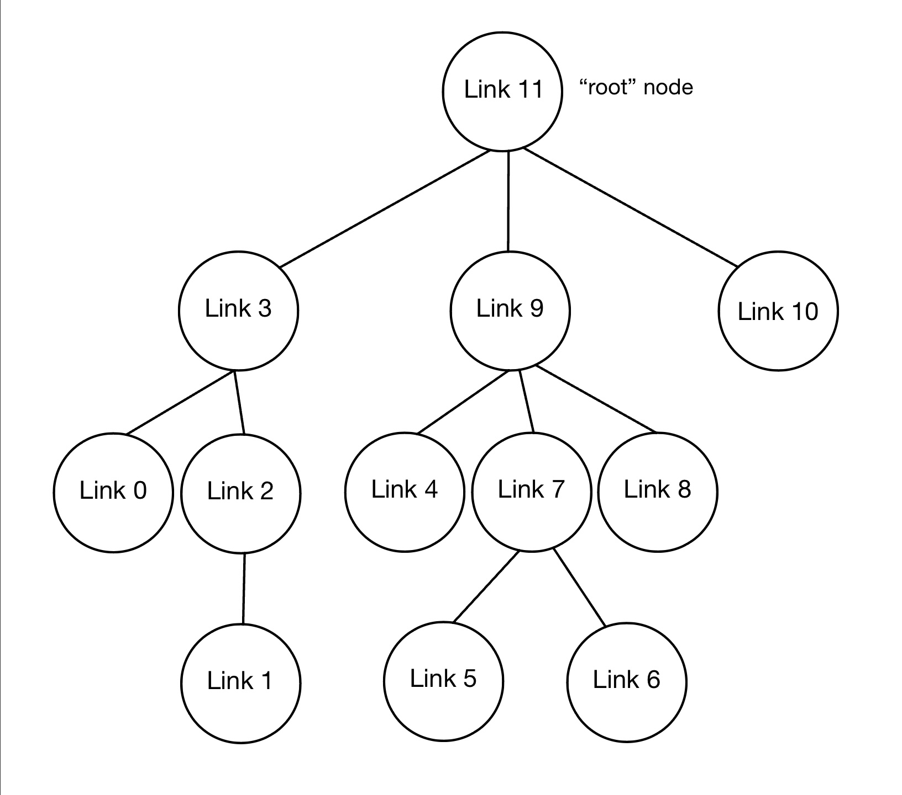
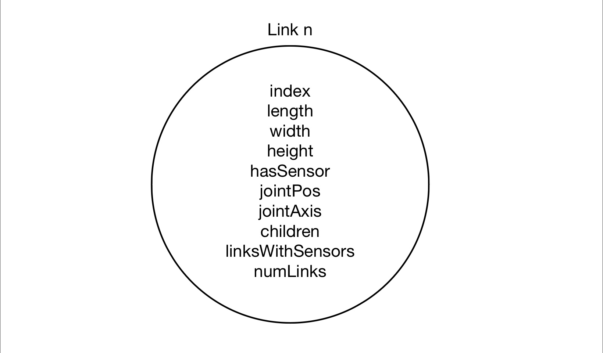
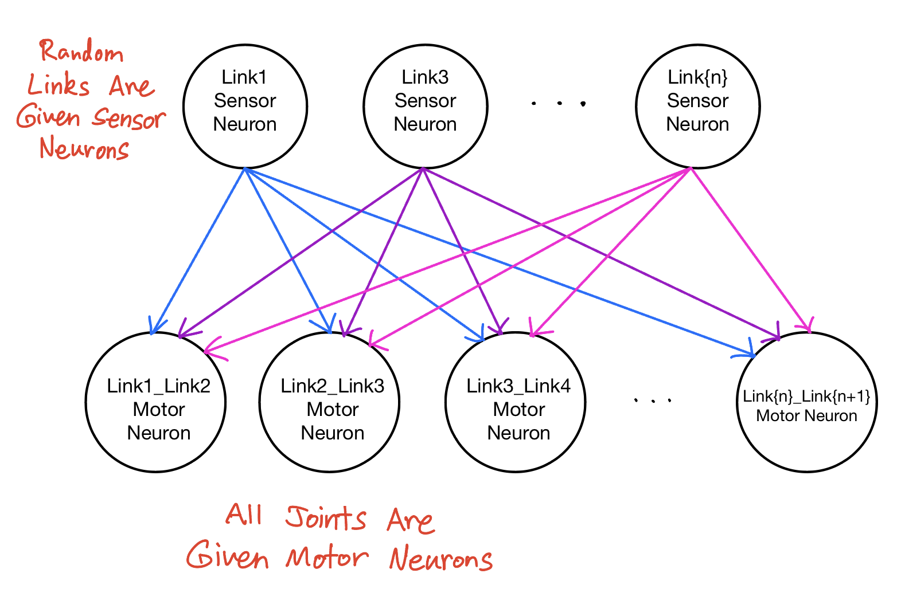

# Randomly Generated 1D Morphologies

This program creates a randomly generated kinematic chain of blocks (like a snake).


## Creature Bodies

The information for each body is organized in a randomly generated tree, as shown below.
<br/>
<br/>

<br/>
<br/>


Each node of the tree represents a link (rectangular prism) on the body. A link contains the following information:
<br/>
<br/>

<br/>
<br/>


| Variable | Description | Value |
| --- | --- | --- |
| index | A unique integer assigned to each link in the tree | An integer in the range [0, n-1], where n is the number of links in the tree |
| length | The length of the link | A randomly generated number in the range [0.2, 1.2] |
| width | The width of the link | A randomly generated number in the range [0.2, 1.2] |
| height | The height of the link | A randomly generated number in the range [0.2, 1.2] |
| hasSensor | A boolean indicating whether or not the link has a sensor | True or False |
| jointPos | Indicates where the link is attached to its parent (12 possible attachment configurations) | An integer in the range [0,11] |
| jointAxis | Indicates the axis of the joint | "1 0 0", "0 1 0", or "0 0 1" |
| children | A list of child links | The root node can have 1-4 child links, while all other nodes can only have 0 or 1 |
| linksWithSensors | A list of all links beneath it that have sensors | List of link indices |
| numLinks | The total number of links beneath it in the tree | An integer in the range [0, n-1], where n is the number of links in the tree |

<br/>

__Note 1:__ The root node adds 1 to numLinks so that it represents the total number of links in the tree (not just the number of links beneath it).
<br />
__Note 2:__ If the root node has a sensor, it adds its own index to linksWithSensors so that the list contains the index of every link that has a sensor (not just the links beneath it that have a sensor).


<br/>


## Creature Brains

### Locations of Sensors

Whether or not each block has a sensor is randomly determined. Blocks with sensors are colored green, while blocks without sensors are colored blue.

### Brain Layout

When generating the brain, only the links with sensors are given sensor neurons. However, all joints are given motor neurons. The activation of each motor neuron is a weighted sum of all the sensor neuron outputs.
<br/>
<br/>

<br/>
<br/>


__Note 1:__ In order to make things simpler, the names of sensor neurons start at 100 and are named 100, 101, 102, ...
<br />
__Note 2:__ The name of a motor neurons is the index of the joint's child link.


<br/>


# Running the code

To run the program, simply type the following into the terminal window:

```bash
$ python3 search.py
```


<br/>


# Fitness

The fitness function is the negative x-position of the first link (leftmost link). The farther left (negative x-direction) the snake travels, the higher its fitness value.


<br/>


# Evolutionary Setup

The simulation was run for 2 generations with a population size of 2. Each population has a randomly generated body at the very beginning of the simulation, and that body stays constant for the population. Within each population, from generation to generation, only the brain evolves by randomly changing one of the weights between a sensor neuron and motor neuron. Therefore, a population size of 5 would have 5 randomly generated bodies at the start of the simulation. Each of these 5 bodies would evolve different brains over time.

<br/>
<br/>

# Demo

Some example creatures can be seen in the YouTube video [here](https://youtu.be/aakqaf5leJk).

<br/>
<br/>

# Note

This project is based on a massively open online course (MOOC) on reddit called [Ludobots](https://www.reddit.com/r/ludobots/wiki/installation/).