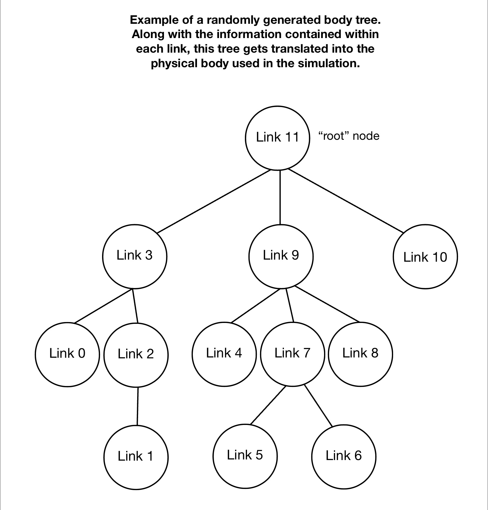
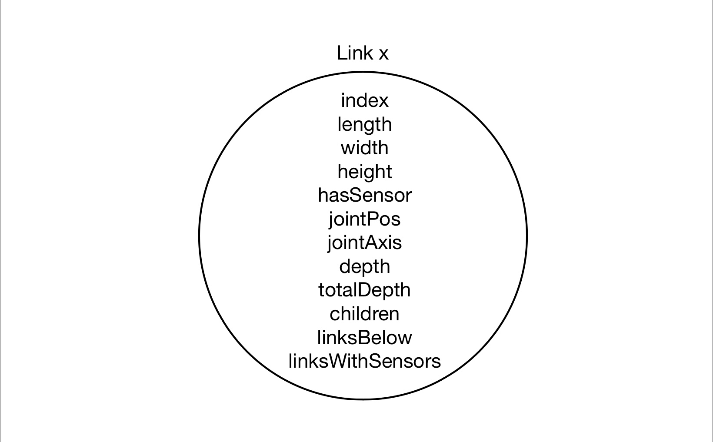
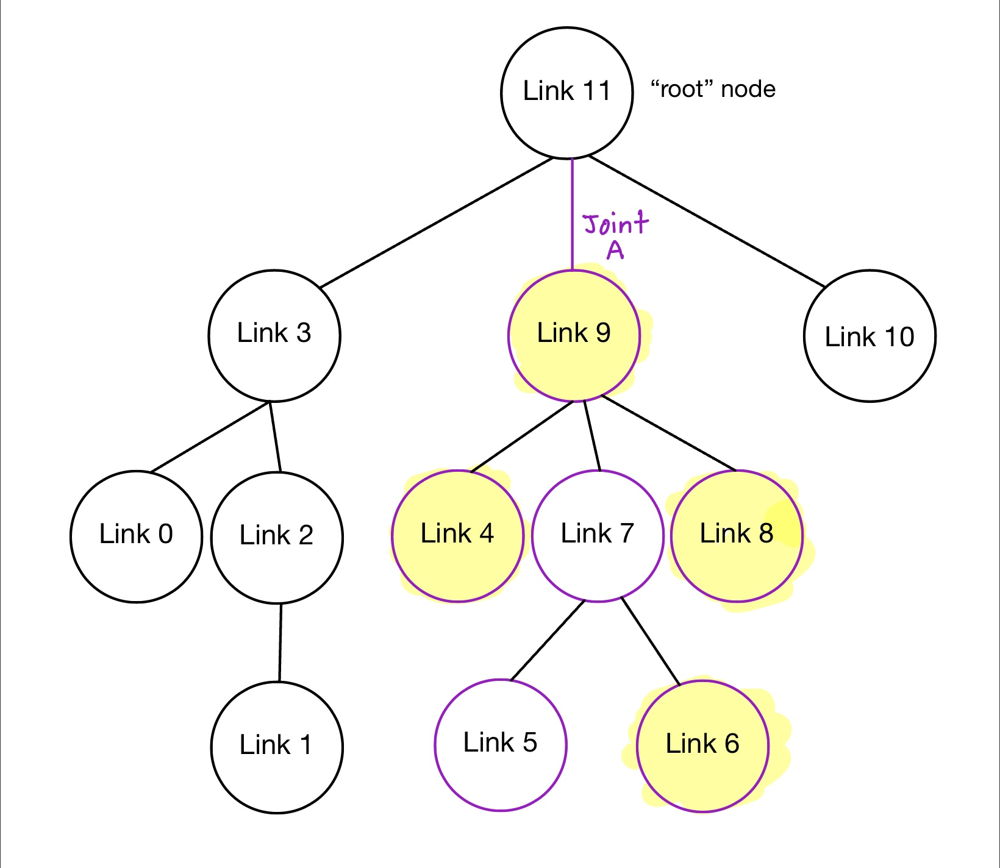
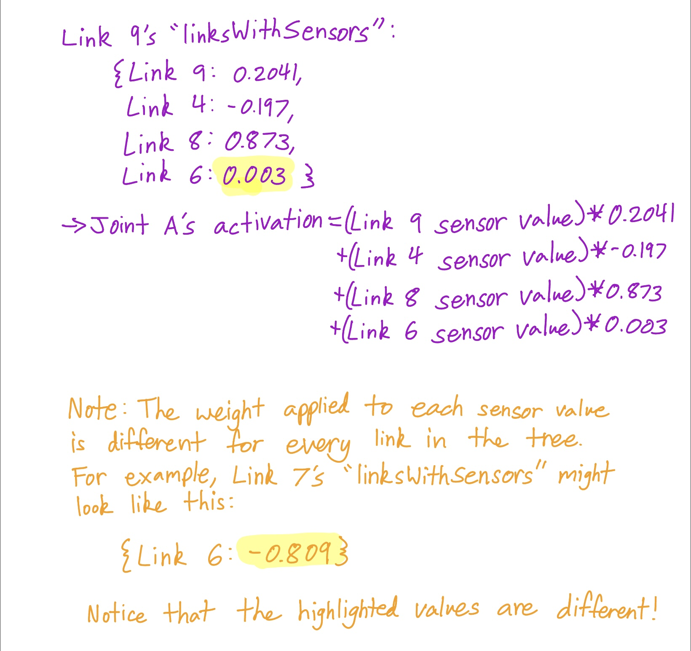

# Comparing Different Evolutionary Algorithms

This final project compares different evolutionary algorithms to see which can develop the best creatures for locomotion.


<br/>


## Running the code

This program allows you to run various different evolutionary algorithms.

To run a **Parallel Hill Climber**, simply type:

```bash
$ python3 search.py phc
```

To run the **(μ,λ) Evolutionary Algorithm**, simply type:

```bash
$ python3 search.py ml
```

To run **Age-Fitness Pareto Optimization**, simply type:

```bash
$ python3 search.py afpo
```


<br/>


## Demo

An exampled of a randomly generated creature vs. a creature evolved using each of these evolutionary algorithms can be seen [here](https://youtu.be/V1Dc-OBX-d0).


<br/>


# Fitness Function

The fitness function is the negative x-position of the first link. The farther left (negative x-direction) the snake travels, the higher its fitness value. The goal of this fitness function is to evolve locomotion in our creatures. When testing these algorithms for many generations, the evolutionary algorithm eventually exploited the physics simulator by embedding itself in the ground, which launches the creature upwards at an angle and results in a large displacement in the x-direction. To penalize this behavior, if the body's z-height exceeds 4 at any point during the simulation, the fitness of the creature is set to -5. Such a fitness value is usually low enough for evolution to naturally discard the solution.


<br/>


# Evolutionary Methods

I tested 3 different evolutionary methods. Each method had a population size of 25 and was run for 200 generations. I tested each method 5 times, each with a different random seed.

## Parallel Hill Climber

The Parallel Hill Climber starts off with 25 individuals. Each individual is in a "silo," meaning that it does not interact with the other individuals in the population. In each generation, the parents have children, and the parent is compared against its child. Whichever has a higher fitness, the parent or the child, moves on to the next generation.
<!-- <br/>

<br/> -->

## (μ,λ) Evolutionary Algorithm

The (μ,λ) Evolutonary Algorithm has 2 key variables:
-**μ:** The number of parents chosen to move onto the next generation
-**λ:** The overall size of the population
<br/>

For our experiments, we used **μ = 5** and **λ = 25**, meaning that our population size was 25 and the top 5 individuals in each generation were chosen to move onto the next generation.

Typically, each individual chosen to move onto the next generation would have **λ/μ - 1** offspring. In this case, that would be **25/5 -1 = 4** offspring per parent. This way, the total population would be **5 parents from the previous generation + (4 offspring/parent) x (5 parents) = 5 + 20 = 25 total individuals**. Thus, the population size stays constant throughout the generations.
<br/>
Unfortunately, this leads to a lack of genetic diversity. In the figure below, each of the starting individuals is given a different color, and every future descendent of that individual is given the same color. From this, we can see that after about the 5th generation, only the yellow lineage prevails and all the other lineages die out. This leads to a lack of genetic diversity, which is very important in evolution.


<br/>

Therefore, I modified this algorithm so that each individual chosen to move onto the next generation would have **λ/μ - 2** offspring. In this case, that would be **25/5 -1 = 3** offspring per parent. Then, I planted *μ = 5* completely new, random creatures into the population. This way, the total population would be **5 individuals from the previous generation + (3 offspring/parent) x (5 parents) + 5 new/random individuals = 5 + 15 + 5 = 25 total individuals**. Thus, the population size stays constant throughout the generations.

<!-- <br/>

<br/> -->

## Parallel Hill Climber

The Parallel Hill Climber starts off with 25 individuals. Each individual is in a "silo," meaning that it does not interact with the other individuals in the population. In each generation, the parents have children, and the parent is compared against its child. Whichever has a higher fitness, the parent or the child, moves on to the next generation.
<!-- <br/>

<br/> -->

<br/>


# Results

The following table lists the best fitness achieved by the end of 200 generations in each of the 5 trials that I ran using each evolutionary algorithm:

| Trial | Parallel Hill Climber | (μ,λ) | Age-Pareto Fitness Optimization |
| --- | --- | --- | --- |
| Trial 1 | 9.220  | 0 | 0 |
| Trial 2 | 15.959 | 0 | 0 |
| Trial 3 | 8.750  | 0 | 0 |
| Trial 4 | 9.344  | 0 | 0 |
| Trial 5 | 9.508  | 0 | 0 |

<br/>

### Parallel Hill Climber

*How to interpret the graphs:* Each line represents a separate hill climber. For a parallel hill climber with a population size of 25, there are 25 separate hill climbers evolving in parallel.


<br/>

<br/>

<br/>

<br/>

<br/>
<br/>

### (μ,λ) Evolutionary Algorithm
*How to interpret the graphs:* Each line represents an individual over the course of evolution. If the individual has a child, the child stems off from its parent line in a new color. If a line randomly begins in the middle of the plot (i.e. it's not branching off another line), that line represents a randomly generated solution. If a line ends randomly, it means that the individual was not fit enough to survive.

 Trial 1")
<br/>
 Trial 2")
<br/>
 Trial 3")
<br/>
 Trial 4")
<br/>
 Trial 5")
<br/>
<br/>

<!-- ### Parallel Hill Climber

<br/>

<br/>

<br/>

<br/>

<br/>
<br/> -->


## Creature Bodies

The information for each body is organized in a randomly generated tree. An example of such a randomly generated tree is shown below.
<br/>
<br/>

<br/>
<br/>


Each node of the tree represents a link (rectangular prism) on the body. A link contains the following information:
<br/>
<br/>

<br/>
<br/>


| Variable | Description | Value |
| --- | --- | --- |
| index | A unique integer assigned to each link in the tree | An integer in the range [0, n-1], where n is the number of links in the tree |
| length | The length of the link | A randomly generated number in the range [0.2, 1.2] |
| width | The width of the link | A randomly generated number in the range [0.2, 1.2] |
| height | The height of the link | A randomly generated number in the range [0.2, 1.2] |
| hasSensor | A boolean indicating whether or not the link has a sensor | True or False |
| jointPos | Indicates where the link is attached to its parent (12 possible attachment configurations) | An integer in the range [0,11] |
| jointAxis | Indicates the axis of the joint | "1 0 0", "0 1 0", or "0 0 1" |
| depth | The depth of the link in the tree. This is sort of an "inverse depth," as the bottom-most link has a depth of 1. | An integer in the range [1, n], where n is the total depth of the tree |
| totalDepth | The total depth of the body tree | An integer in the range [2, 5] |
| children | A list of direct child links | The root node can have 1-4 child links, while all other nodes can only have 0 or 1 |
| linksBelow | A list containing the link's own index as well as all the indices of it descendent links | List of link indices |
| linksWithSensors | A dictionary whose keys are the indices of all the descendent links that have sensors (including its own index if it has a sensor). The associated values are randomly generated weights in the range [-1, 1] | Dictionary with link indices as keys and random numbers in the range [-1, 1] as values |

<br/>

__Note 1:__ Each node's *linksWithSensors* dictionary has unique weights corresponding to each sensor.
<br />
__Note 2:__ The root node's *linksBelow* array is a list of every node in the tree, as everything is a descendent of the root node.
<br />
__Note 3:__ The keys in the root node's *linksWithSensors* dictionary encompasses every link that has a sensor in the tree.


<br/>


## Creature Brains

### Locations of Sensors

Whether or not each block has a sensor is randomly determined. Blocks with sensors are colored green, while blocks without sensors are colored blue.

### Local Brain

All of the information for the brain is contained within the link nodes. Most of this data is stored within the *linksWithSensors* dictionaries, which contain link indices as keys and weights as the corresponding values. When a link is added or removed, this change is propagated through the tree by altering the relevant *linksWithSensors* dictionaries.

When generating the brain, only the links with sensors are given sensor neurons (a list of such links is contained within the keys of the root node's *linksWithSensors* dictionary). However, all joints are given motor neurons. The activation of each motor neuron is a weighted sum of all the sensor values of its descendent links. The associated weights are taken from the *linksWithSensors* dictionary of the joint's child link. An example of this is shown below.
<br/>
<br/>

<br/>

<br/>
<br/>


__Neuron Naming Convention:__
- The name of a motor neuron is the index of the joint's child link.
- The names of a sensor neuron is equal to the index of the link + 100, in order to prevent overlap with the names of motor neurons.


<br/>


## Mutations

| Mutation | Description | Probability |
| --- | --- | --- |
| Remove a link | The link and all of its descendent links are removed from the tree. The *linksWithSensors* dictionary and *linksBelow* list belonging to all the ancestor nodes of the removed link are updated accordingly. | 0.1 |
| Add a link | A link is added to the tree. | 0.1 |
| Change link length | The length of the link is changed to a randomly generated number in the range [0.2, 1.2]. | 0.3 |
| Change link width | The width of the link is changed to a randomly generated number in the range [0.2, 1.2]. | 0.3 |
| Change link height | The height of the link is changed to a randomly generated number in the range [0.2, 1.2]. | 0.3 |
| Change joint axis | The joint axis between the link and its parent is changed. | 0.2 |
| Add sensor | A sensor is added to the link if it didn't already have one. | 0.2 |
| Remove sensor | The sensor is removed from the link if it previously had one. | 0.2 |
| Alter synapse weight | The synapse weight is changed to a new value in the range [-1, 1]. | 0.1 |


<br/>


# Note

This project is based on a massively open online course (MOOC) on reddit called [Ludobots](https://www.reddit.com/r/ludobots/wiki/installation/). It also builds on the Pyrosim library which can be found [here](https://github.com/jbongard/pyrosim).