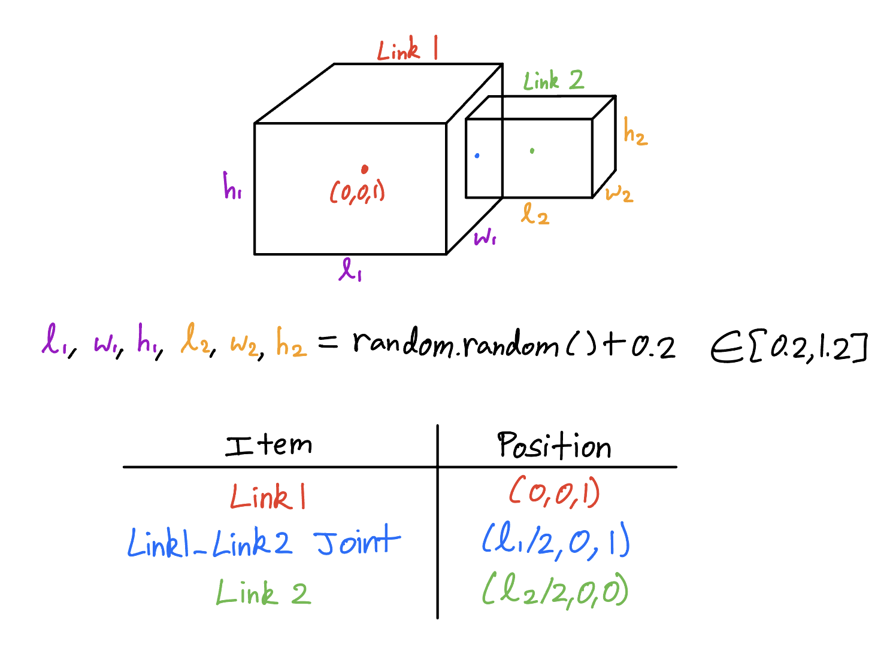
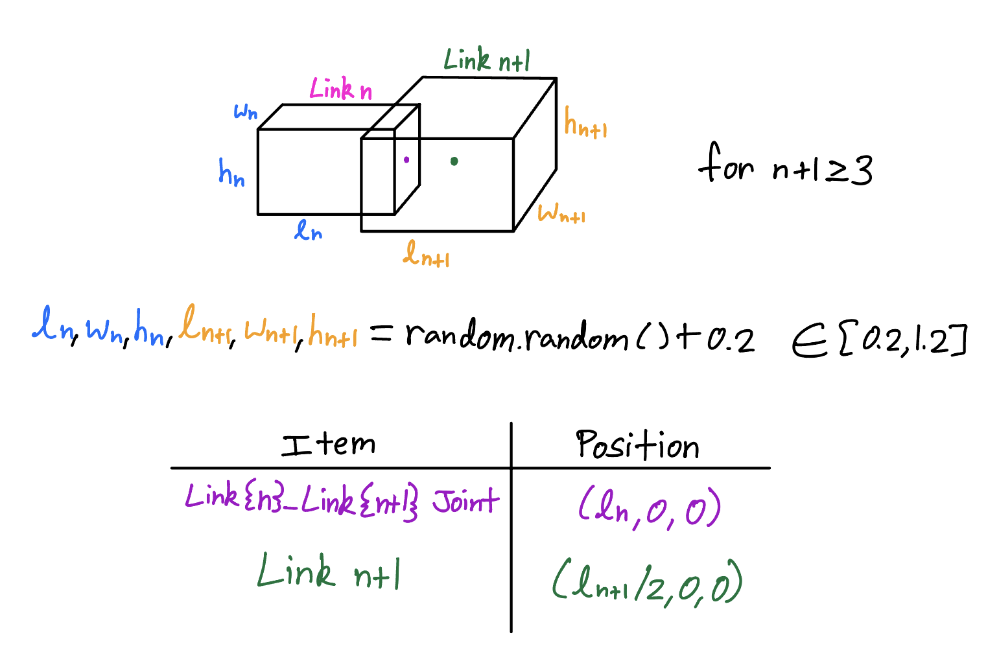
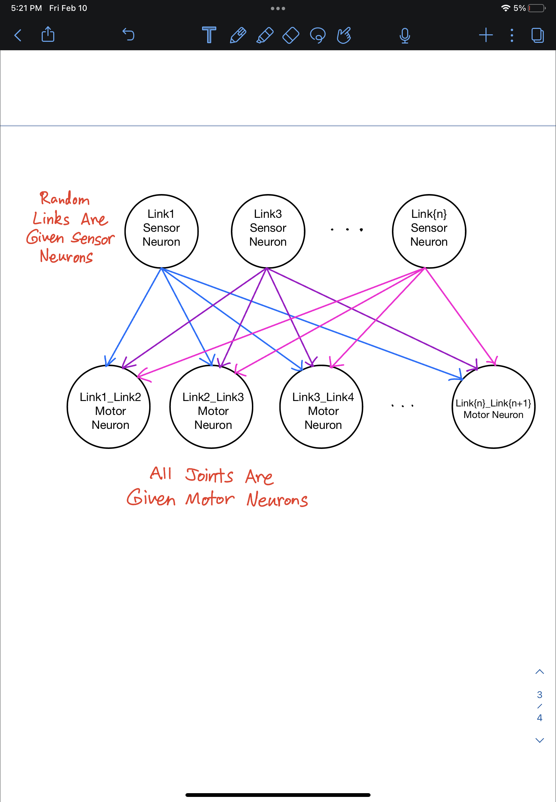

# Randomly Generated 1D Morphologies

This program creates a randomly generated kinematic chain of blocks (like a snake).


## Creature Bodies

##### Number of Blocks
The number of blocks in the chain is randomly generated, and lies in the range [3,10].

##### Size of Blocks
The dimensions of each block are also randomly generated. The size of each dimension lies in the range [0.2,1.2].

##### Joint Axes
The joint axes are all aligned with the y-axis, as this was found to result in the best movement.

### Generating the First 2 Links

When generating the bodies, the first 2 links are created seprately. This is because the first joint, which connects Link 1 and Link 2, is positioned relative to the previous _Link_ as opposed to the previous _Joint_.
<br/>
<br/>


<br/>

### Generating All Subsequent Links

When generating the links after the first two links, the following positioning is used. Note that all of these coordinates are in relation to the previous (upstream) joint.
<br/>
<br/>



## Creature Brains

### Locations of Sensors

Whether or not each block has a sensor is randomly determined. Blocks with sensors are colored green, while blocks without sensors are colored blue.

### Brain Layout

When generating the brain, only the links with sensors are given sensor neurons. However, all joints are given motor neurons. The activation of each motor neuron is a weighted sum of all the sensor neuron outputs.
<br/>
<br/>



# Running the code

To run the program, simply type the following into the terminal window:

```bash
$ python3 search.py
```


# Fitness

The fitness function is the negative x-position of the first link (leftmost link). The farther left (negative x-direction) the snake travels, the higher its fitness value.


# Evolutionary Setup

The simulation was run for 10 generations with a population size of 2. Each population has a randomly generated snake body at the very beginning of the simulation, and that body stays constant for the population. Within each population, from generation to generation, only the brain evolves by randomly changing one of the weights between a sensor neuron and motor neuron. Therefore, a population size of 5 would have 5 randomly generated bodies at the start of the simulation. Each of these 5 bodies would evolve different brains over time.


# Demo

Some example snakes can be seen in the YouTube video [here](https://youtu.be/ctL79FnjyLk).


# Note

This project is based on a massively open online course (MOOC) on reddit called [Ludobots](https://www.reddit.com/r/ludobots/wiki/installation/).